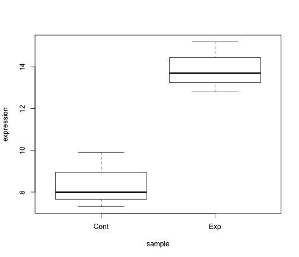
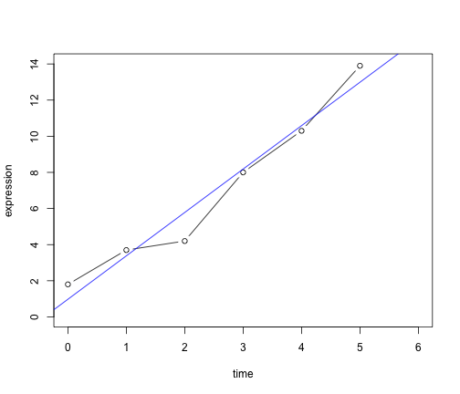

RとBioconductorでNGS解析: 第1時限 Rの基礎
========================================================

## はじめに
この文章は統合データベース講習会：AJACSみちのく2「RとBioconductorを使ったNGS解析」の講義資料です。

この文章の著作権は二階堂愛にあります。ファイルのダウンロード、印刷、複製、大量の印刷は自由におこなってよいです。企業、アカデミアに関わらず講義や勉強会で配布してもよいです。ただし販売したり営利目的の集まりで使用してはいけません。ここで許可した行為について二階堂愛に連絡や報告する必要はありません。常に最新版を配布したいので**ネット上での再配布や転載は禁止**します。ネット上でのリンクはご自由にどうぞ。内容についての問い合わせはお気軽にメールしてください。

## 対象
ここでは、本講義を理解する上で知っておきたい、Rの基本的な使いかたについて解説する。対象とするのはプログラミング初心者でRを利用したことがない人が対象である。

## 準備
まずは R をインストールする。http://rstudio.org/ から、利用しているOSに適した RStudio をインストールする。起動や終了は普通のアプリケーションと同じである。起動したときに3つのペイン(ウィンドウ内にある小窓)が見えるが、左下の console という部分に、Rのプログラムを書き込んでいく。

試しに以下のように入力して同じ結果になれば準備は終了である。ただし、あなたの環境では ## は表示されないがそれで正常である。

```r
1 + 1
```

```
## [1] 2
```


## 学習範囲
プログラミング言語を理解するときに必要なことは、以下の3つである。

- データ型とデータ構造を知る
- 基本の3つの処理の書きかたを理解する
- 自分が使う便利な機能(関数、パッケージ)を覚える

この文章では、この3つについて簡単に説明する。

## データ型
データ型 (data type) とはデータの形式のことを意味する。例えば数値や文字列、論理型などがある。

```r
x <- c()
x
```

```
## NULL
```

```r
y <- c(1, 2)
y
```

```
## [1] 1 2
```

```r
z <- c("ATG", "GCG", "CTG", "TTA")
z
```

```
## [1] "ATG" "GCG" "CTG" "TTA"
```

```r
b <- c(TRUE, FALSE)
b
```

```
## [1]  TRUE FALSE
```

### データ型の変換
異なるデータ型を行き来したい場合がある。多くのプログラムのエラーはここが原因となるため、データの型の変換方法と、型を調べる方法を理解することは重要である。

```r
y <- as.character(y)
y
```

```
## [1] "1" "2"
```

```r
as.numeric(y)
```

```
## [1] 1 2
```

```r
y
```

```
## [1] "1" "2"
```

### 型の確認

```r
is(1)
```

```
## [1] "numeric" "vector" 
```

```r
is("1")
```

```
## [1] "character"           "vector"              "data.frameRowLabels"
## [4] "SuperClassMethod"   
```


## データ構造
前項ではデータを格納する型について解説した。このデータを集めて、決まった構造でデータを束ねておくのがデータ構造 (data structure) である。プログラミング言語が決まったデータ構造を提供することで、様々な計算が楽にできるようになる。なぜなら、データの中身が違っても構造が同じことを利用し汎用的な計算機能(関数)を用意できるからである。また、言語側で、データ構造に対する計算の効率を最適化しておくことができ、ユーザはそのデータ構造さえ使っておけば、高速化などに配慮しなくても良くなる。プログラム言語の善し悪しはこのデータ構造とそれを処理する機能の善し悪しによって決まるとも言える。

ここではRの基本的なデータ構造, vector, list, matrix, data frame について述べる。
### vector
vector は1種類のデータ型からなる1次元データを格納するためのデータ構造である。

```r
x <- c(3, 2, 4, 1)
x
```

```
## [1] 3 2 4 1
```

### list
list は複数のデータ型からなる1次元データを格納することができるデータ構造である。例えば文字列型と数値を同時に格納できる。

```r
y <- list(3, 2, 4, 1)
y
```

```
## [[1]]
## [1] 3
## 
## [[2]]
## [1] 2
## 
## [[3]]
## [1] 4
## 
## [[4]]
## [1] 1
## 
```

### matrix
matrix は1種類のデータ型からなる2次元データを格納するためのデータ構造である。いわゆる行列を表現することができる。

```r
z <- matrix(c(3, 2, 1, 2, 0, 1, 4, 5, 7, 1, 3, 3), nrow = 3)
z
```

```
##      [,1] [,2] [,3] [,4]
## [1,]    3    2    4    1
## [2,]    2    0    5    3
## [3,]    1    1    7    3
```

### data frame
data frame は複数のデータ型からなる2次元データを格納するためのデータ構造である。Excel などのスプレットシートをイメージすればよい。数値行列だけを持つ場合は、matrix のほうが data frame より高速である。


```r
d <- data.frame(first = c(3, 2, 1), first.base = c("A", "T", "G"), second = c(4, 
    5, 7), second.base = c("C", "G", "C"))
d
```

```
##   first first.base second second.base
## 1     3          A      4           C
## 2     2          T      5           G
## 3     1          G      7           C
```

### データ構造を確認する
どんなデータ構造を利用しているかを確認する方法を述べる。自分が使っているデータ構造を理解しておかないと、プログラムのエラー(バグ)の原因となる。特定のデータ構造を前提としている機能を使うとき、データ構造や型が異なる場合は、自動的に型や構造を変換したり、エラーを出したりする。

```r
is(z)
```

```
## [1] "matrix"    "array"     "structure" "vector"   
```

```r
is(d)
```

```
## [1] "data.frame" "list"       "oldClass"   "vector"    
```

```r
str(d)
```

```
## 'data.frame':	3 obs. of  4 variables:
##  $ first      : num  3 2 1
##  $ first.base : Factor w/ 3 levels "A","G","T": 1 3 2
##  $ second     : num  4 5 7
##  $ second.base: Factor w/ 2 levels "C","G": 1 2 1
```


### データにアクセスする
データ構造にデータを出し入れする方法を示す。行や列の各要素を示す番号を添字 (index) と呼ぶ。これを使ってデータを取り出したり、代入することが可能である。

まず vector の要素にアクセスする方法を示す。添字は一番左から1,2,3,... となる。プログラミング言語によっては、添字が 0 から始まるものもあるが、R は 1 であることに注意すること。

```r
x <- c(3, 2, 4, 1)
x[1]
```

```
## [1] 3
```

```r
x[1] <- 4
x
```

```
## [1] 4 2 4 1
```

```r
x[1:2]
```

```
## [1] 4 2
```

```r
x[1:2] <- c(3, 8)
x
```

```
## [1] 3 8 4 1
```

次に list の要素にアクセスする方法を示す。

```r
x <- list(3, 2, 4, 1)
x[[1]]
```

```
## [1] 3
```

```r
x[[2]] <- 5
x
```

```
## [[1]]
## [1] 3
## 
## [[2]]
## [1] 5
## 
## [[3]]
## [1] 4
## 
## [[4]]
## [1] 1
## 
```

次は、matrix の要素にアクセスする方法を示す。横方向が行、縦方向が列であり、これは数学の行列と同じである。


```r
x <- matrix(c(3, 2, 1, 2, 0, 1, 4, 5, 7, 1, 3, 3), nrow = 3)
x[1, ]  # 1行目にアクセス
```

```
## [1] 3 2 4 1
```

```r
x[, 2]  # 2列目にアクセス
```

```
## [1] 2 0 1
```

```r
x[3, 2]  # 3行2列目にアクセス
```

```
## [1] 1
```

```r
x[3, 2] <- 9  # 3行2列目に9を
x[3, ]
```

```
## [1] 1 9 7 3
```

最後に data frame の要素にアクセスする方法を示す。

```r
x <- data.frame(first = c(3, 2, 1), first.base = c("A", "T", "G"), second = c(4, 
    5, 7), second.base = c("C", "G", "C"))
x$first
```

```
## [1] 3 2 1
```

```r
x$first.base
```

```
## [1] A T G
## Levels: A G T
```

```r
x$first.base <- c("T", "C", "A")
x$first.base
```

```
## [1] "T" "C" "A"
```


## 3つの基本的な処理
プログラミング言語は基本的には3つの処理の組み合わせで実行される。ダイクストラの構造化プログラミング (Structured Programming) では、基本的な処理として3つの処理が挙げられている。

順次: 書かれた順番に処理していく
反復: 条件が満されるまで処理を繰り返す
分岐: 条件が成立する場合は実行する

順次処理については、これまでも示してきた通りなので割愛するが、Rの場合は文単位 (行ではない) で上から下へと順次処理される。

次に反復処理について示す。ここでは、*for* を利用した繰り返しの構文を示す。

```r
ans <- 0
for (i in 1:10) {
    ans <- ans + i
}
ans
```

```
## [1] 55
```

次に *if* を使って条件によって処理を分岐してみる。

```r
odd <- 0
even <- 0
for (i in 1:10) {
    if (i%%2 == 0) {
        even <- even + i
    } else {
        odd <- odd + i
    }
}
cat(even, odd, "\n")
```

```
## 30 25 
```


### 関数
関数 (function) とは、便利な機能のひとかたまりにしたものである。プログラミング言語には様々な関数が定義されており、この関数の豊富さが言語の使い易さに深く関わっている。Rでは文字や数値の処理だけでなく、統計処理のための便利な関数が多数用意されている。関数は膨大にあるので、まず自分の使う関数だけを覚えておき、必要に応じてリファレンスや Web検索などで必要な関数を調べるのがお勧めである。

簡単な統計量を計算する関数を紹介する。

```r
x <- 1:100
x.sum <- sum(x)
x.mean <- mean(x)
x.sd <- sd(x)
cat(x.sum, x.mean, x.sd, "\n")
```

```
## 5050 50.5 29.01 
```


関数を自分で作ることもできる。自分がよく使う機能をまとめておくことで、プログラムの見通しもよくなったり、機能が再利用しやすくなったり、プログラムコードのメンテナンスしやすくなるなどのメリットが多いので、積極的に利用したい機能である。ひとつの関数はなるべくひとつの機能を果すようにし、画面1枚以内に収まる程度にするのがお勧めである。それが守られないときは、よく考えて、複数の関数に分割することが重要である。

ここでは簡単な関数の例として、DNA配列の相補鎖を計算する関数を定義してみる。

```r
complement <- function(x) {
    if (x == "A") {
        return("T")
    } else if (x == "T") {
        return("A")
    } else if (x == "G") {
        return("C")
    } else if (x == "C") {
        return("G")
    } else {
        return("N")
    }
}
complement("A")
```

```
## [1] "T"
```

```r
complement("G")
```

```
## [1] "C"
```

```r
complement("*")
```

```
## [1] "N"
```


定義されている関数の使い型を調べるには *help* を利用する。またRの良いところとして、関数の多くに実行例が付属していることである。これを実行するには、*example* を利用する。
#### 関数の使いかたを調べる

```r
help(sum)
example(mean)
```

```
## 
## meanR> x <- c(0:10, 50)
## 
## meanR> xm <- mean(x)
## 
## meanR> c(xm, mean(x, trim = 0.10))
## [1] 8.75 5.50
```


## パッケージを使う
パッケージとは、複数の便利な関数をまとめて提供するものである。R のパッケージは CRAN と Bioconductor から配布されている。パッケージは世界中の開発者によって各々、開発されており、最新の統計手法から、あらゆる実験機器のデータを扱うものまで様々である。特に Bioconductor はバイオインフォマティクス関連のパッケージに特化しており、CRAN よりもソースコードのレビューやドキュメンテーションのルールが厳しく、パッケージが比較的良質に保たれている。

まず、CRANからパッケージをインストールする方法を述べる。パッケージはコマンドから簡単にインストールができ *install.packages* を利用する。

```r
install.packages("ggplot2")
```

```
## 
## The downloaded binary packages are in
## 	/var/folders/cz/cny0ysmx205dnj0y2_34k8cc0000gn/T//RtmpThGePp/downloaded_packages
```

いろいろメッセージが表示されるが気にする必要はない。インストールが正常に終了していれば、以下のように *library* でパッケージの機能を読み込むことができる。

```r
library("ggplot2")
```


次に、Bioconductor からパッケージをダウンロードする。これにはまず専用の関数を *biocLite* を設定する必要がある。ここでは、*biocLite* を設定し、マウス脳トランスクリプトームデータ解析ツールである *BrainStars* パッケージをインストールする。

```r
source("http://bioconductor.org/biocLite.R")
biocLite("BrainStars")
```

```
## BioC_mirror: http://bioconductor.jp/
```

```
## Using R version 2.15, BiocInstaller version 1.4.7.
```

```
## Warning: 開けません：HTTP ステータスは '404 Not Found' です
```

```
## Warning: 開けません：HTTP ステータスは '404 Not Found' です
```

```
## Warning: unable to access index for repository
## http://brainarray.mbni.med.umich.edu/bioc/bin/macosx/leopard/contrib/2.15
```

```
## Installing package(s) 'BrainStars'
```

```
## Warning: 開けません：HTTP ステータスは '404 Not Found' です
```

```
## Warning: 開けません：HTTP ステータスは '404 Not Found' です
```

```
## Warning: unable to access index for repository
## http://brainarray.mbni.med.umich.edu/bioc/bin/macosx/leopard/contrib/2.15
```

```
## Warning: 開けません：HTTP ステータスは '404 Not Found' です
```

```
## Warning: 開けません：HTTP ステータスは '404 Not Found' です
```

```
## Warning: unable to access index for repository
## http://brainarray.mbni.med.umich.edu/bioc/bin/macosx/leopard/contrib/2.15
```

インストールしたパッケージは、CRANパッケージと同様に、*library* でインストールが可能である。ここでは、3つの遺伝子IDを指定し、それらの脳50領域の遺伝子発現量を取り出している。

```r
library(BrainStars)
ids <- c("1439627_at", "1439631_at", "1439633_at")
my.esets <- getBrainStars(query = ids, type = "expression")
exprs(my.esets)
```

```
##                LS   LS.1     RS   RS.1 Cx_motor Cx_motor.1 Cx_cingulate
## 1439627_at 12.868 12.854  5.686  5.771    5.643      5.650        7.125
## 1439631_at  6.408  6.851  6.562  6.485    6.191      6.493        6.194
## 1439633_at 10.286 10.164 10.449 10.540   10.293     10.366       10.452
##            Cx_cingulate.1 OB_anterior OB_anterior.1 OB_posterior
## 1439627_at          7.657      10.992        10.772        10.83
## 1439631_at          6.539       7.315         7.445         7.45
## 1439633_at         10.421      10.243        10.340        10.37
##            OB_posterior.1    Pir  Pir.1    Tu  Tu.1 ventral_S ventral_S.1
## 1439627_at         10.592  6.263  5.842 8.711 8.297     5.557       5.459
## 1439631_at          7.807  7.019  6.966 6.674 6.667     6.766       6.654
## 1439633_at         10.338 10.735 10.845 9.657 9.823    10.081       9.937
##               CA1  CA1.1 CA2_CA3 CA2_CA3.1     DG   DG.1 A_anterior
## 1439627_at  6.477  7.560   6.044     6.419  8.213  8.600      6.147
## 1439631_at  6.469  6.562   6.759     6.314  6.796  6.843      6.815
## 1439633_at 10.611 10.637  10.267    10.221 10.948 10.956      9.842
##            A_anterior.1 A_posterior A_posterior.1     GP  GP.1 CPu_lateral
## 1439627_at        5.156       4.999         4.934  8.210 8.028       7.961
## 1439631_at        6.629       6.794         6.613  6.867 6.503       6.504
## 1439633_at        9.794      10.356        10.491 10.066 9.948       9.233
##            CPu_lateral.1 CPu_medial CPu_medial.1     MD   MD.1  VA_VL
## 1439627_at         7.956      7.665        7.469 11.754 12.097 12.284
## 1439631_at         6.536      6.417        6.654  6.467  6.543  6.735
## 1439633_at         9.171      9.408        9.245 11.452 11.459 10.871
##            VA_VL.1 VPM_VPL VPM_VPL.1     LG   LG.1     MG   MG.1     Hb
## 1439627_at  11.720  12.228    11.945 12.383 12.309 12.130 12.040 12.943
## 1439631_at   6.323   6.121     6.524  6.234  6.738  6.432  6.439  6.882
## 1439633_at  10.761  10.867    10.775 10.611 10.463 11.028 10.946  9.832
##              Hb.1 Pineal Pineal.1     M   M.1    ME  ME.1 Pituitary
## 1439627_at 12.993 10.500   10.418 9.154 8.963 6.477 6.633     5.038
## 1439631_at  6.917  8.658    8.619 7.096 6.844 8.122 8.344     7.431
## 1439633_at 10.133  8.645    8.950 9.524 9.837 9.260 8.916    10.298
##            Pituitary.1    SCN  SCN.1    MPA  MPA.1     SO   SO.1     Pa
## 1439627_at       4.505 11.140 10.935 10.826 11.055 10.234 10.369 10.331
## 1439631_at       8.091  7.081  7.358  6.861  6.996  6.623  6.538  6.880
## 1439633_at      10.470  8.846  8.977  9.337  9.023  9.647  9.585  9.489
##              Pa.1 SPa_ventral SPa_ventral.1 SPa_dorsal SPa_dorsal.1    DM
## 1439627_at 10.196      11.342        11.038      6.941        6.890 7.063
## 1439631_at  6.978       8.023         7.141      7.994        7.283 6.834
## 1439633_at  9.548       9.548         9.513      9.484        9.703 9.304
##             DM.1   VMH VMH.1   Arc Arc.1     LH  LH.1   PAG PAG.1     SC
## 1439627_at 6.580 5.898 6.079 6.212 6.736 10.061 9.855 6.723 7.451  8.381
## 1439631_at 7.252 6.707 6.938 7.088 7.065  6.703 6.734 6.757 6.720  6.902
## 1439633_at 9.518 9.437 9.377 9.407 9.035  9.570 9.356 9.807 9.985 10.178
##              SC.1     IC   IC.1   VTA VTA.1     SN   SN.1     Tg   Tg.1
## 1439627_at  9.588 10.655  7.416 7.060 6.054  7.071  8.107  6.141  8.989
## 1439631_at  6.917  6.891  6.631 7.721 7.366  6.185  6.171  6.762  6.785
## 1439633_at 10.239 10.180 10.324 9.732 9.896 10.090 10.053 10.125 10.295
##                Pn   Pn.1    MVe MVe.1 Cb_vermis Cb_vermis.1 Cb_lobe
## 1439627_at 11.019 11.206 10.069 10.41    13.023       12.88  12.953
## 1439631_at  6.562  6.508  6.547  6.52     7.789        7.57   7.641
## 1439633_at 10.635 10.673 10.355 10.43    10.614       10.51  10.683
##            Cb_lobe.1 Cb_nucleus Cb_nucleus.1 spinal_cord_anterior
## 1439627_at    13.105      9.774       10.216                7.581
## 1439631_at     7.819      6.534        6.508                6.352
## 1439633_at    10.771     10.593       10.547                9.931
##            spinal_cord_anterior.1 spinal_cord_posterior
## 1439627_at                  7.675                 9.452
## 1439631_at                  6.391                 6.695
## 1439633_at                  9.941                 9.976
##            spinal_cord_posterior.1 Retina Retina.1
## 1439627_at                   9.638  8.233    6.822
## 1439631_at                   6.507  7.340    6.641
## 1439633_at                  10.019  8.668    8.967
```


## 簡単な統計解析
Rは、統計解析のための関数を多く持つため、あらゆる統計解析が可能である。ここでは簡単な例として、検定と回帰を取り上げる。

### 検定
ある遺伝子の発現量を測定したとしよう。ここでは、処理群(ここではExp)と対照群(ここではCont)でそれぞれ n = 3, つまり3回の biological replication の発現量を測定してあるとする。これを data frame に格納し、処理、対照群間の平均値の差の検定、ここではT検定を行う。

```r
gene <- data.frame(sample = c("Exp", "Exp", "Exp", "Cont", "Cont", "Cont"), 
    expression = c(12.8, 13.7, 15.2, 8, 7.3, 9.9))
t.test(expression ~ sample, data = gene)
```

```
## 
## 	Welch Two Sample t-test
## 
## data:  expression by sample 
## t = -5.26, df = 3.957, p-value = 0.006442
## alternative hypothesis: true difference in means is not equal to 0 
## 95 percent confidence interval:
##  -8.415 -2.585 
## sample estimates:
## mean in group Cont  mean in group Exp 
##                8.4               13.9 
## 
```

統計解析を行うときには ***必ず*** グラフを書いて、データの傾向を目視することを忘れてはならない。ここでは boxplot で2群の傾向を可視化する。

```r
plot(expression ~ sample, data = gene)
```

 


### 回帰
ここでは、一日ごとに遺伝子発現を測定したとする。この遺伝子発現が時間に応じてどのように変化しているか、その傾向を知りたいとする。そこで、一日ごとの発現量を data frame に格納し、回帰分析を行う。

```r
gene <- data.frame(time = c(0, 1, 2, 3, 4, 5), expression = c(1.8, 3.7, 4.2, 
    8, 10.3, 13.9))
gene.lm <- lm(expression ~ time, data = gene)
gene.lm
```

```
## 
## Call:
## lm(formula = expression ~ time, data = gene)
## 
## Coefficients:
## (Intercept)         time  
##       0.976        2.403  
## 
```

```r
summary(gene.lm)
```

```
## 
## Call:
## lm(formula = expression ~ time, data = gene)
## 
## Residuals:
##      1      2      3      4      5      6 
##  0.824  0.321 -1.582 -0.185 -0.288  0.910 
## 
## Coefficients:
##             Estimate Std. Error t value Pr(>|t|)
## (Intercept)    0.976      0.744    1.31  0.25978
## time           2.403      0.246    9.78  0.00061
## 
## Residual standard error: 1.03 on 4 degrees of freedom
## Multiple R-squared: 0.96,	Adjusted R-squared: 0.95 
## F-statistic: 95.6 on 1 and 4 DF,  p-value: 0.000613 
## 
```

次に生データと回帰分析によって得られた回帰直線を同時にプロットする。

```r
plot(gene, type = "b", xlim = c(0, 6), ylim = c(0, 14))
abline(gene.lm, col = "blue")
```

 


## 次になにを学べばよいか
何度も強調するが自分が必要な機能から学ぶのがよい。ただし最低限Rに実験データを取り込むために、ファイルの入出力の方法を学んでおくとよいであろう。具体的には、*read.csv*, *read.table*, *write.table* などである。またデータ型やデータタイプに関しては主要なものだけを説明しており、Rの機能を網羅しているわけではない。また、*for* ではなく *apply* 族と呼ばれる関数群を使うことや、反復処理ではなくベクトル計算を行うことなどの R らしいコーディングスタイルを学ぶことも重要である。最終的には自分のデータに合せて、Bioconductor, CRAN パッケージの使いかたを覚えるのが次の目標となる。
